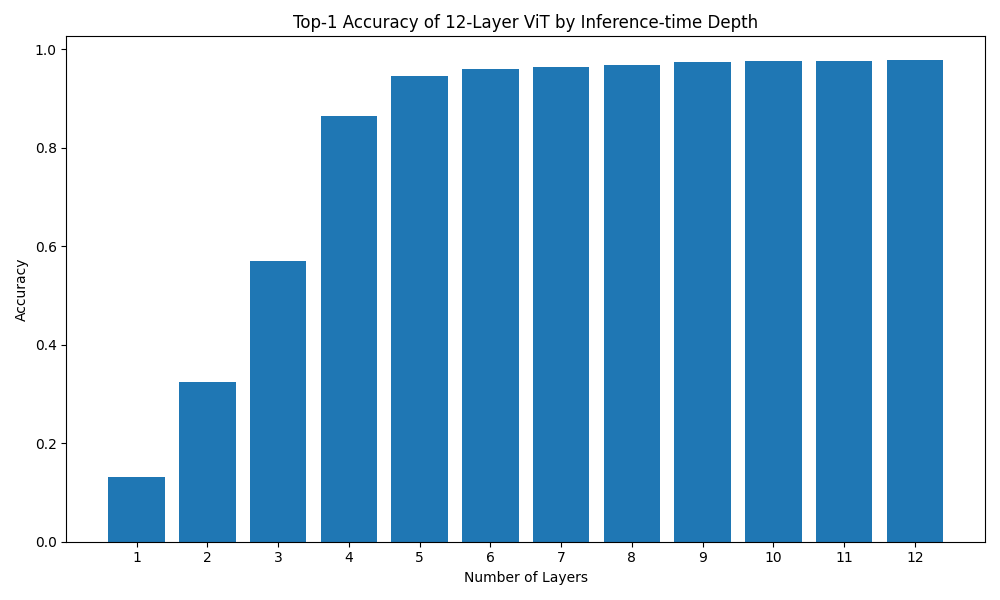
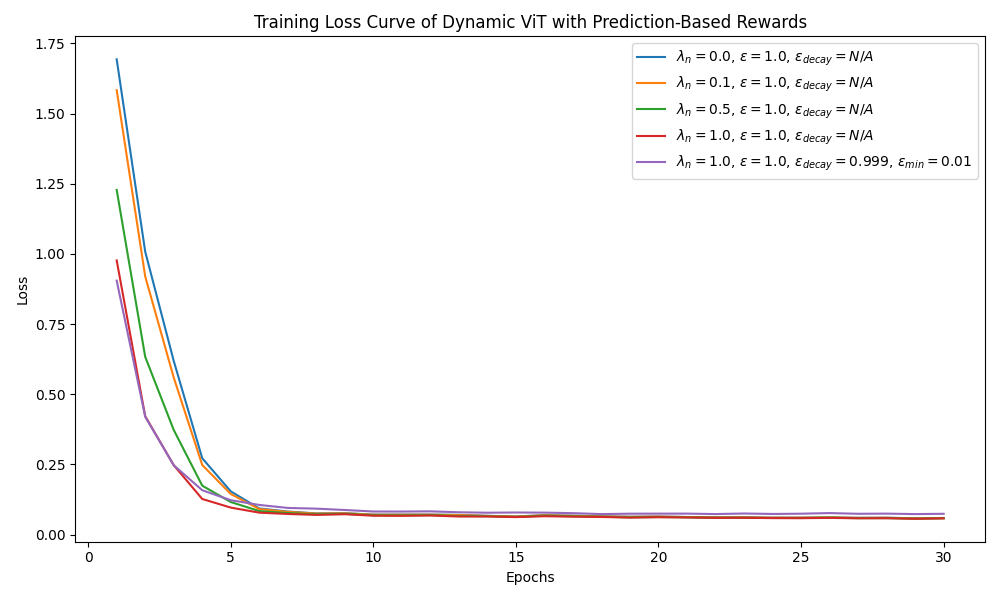
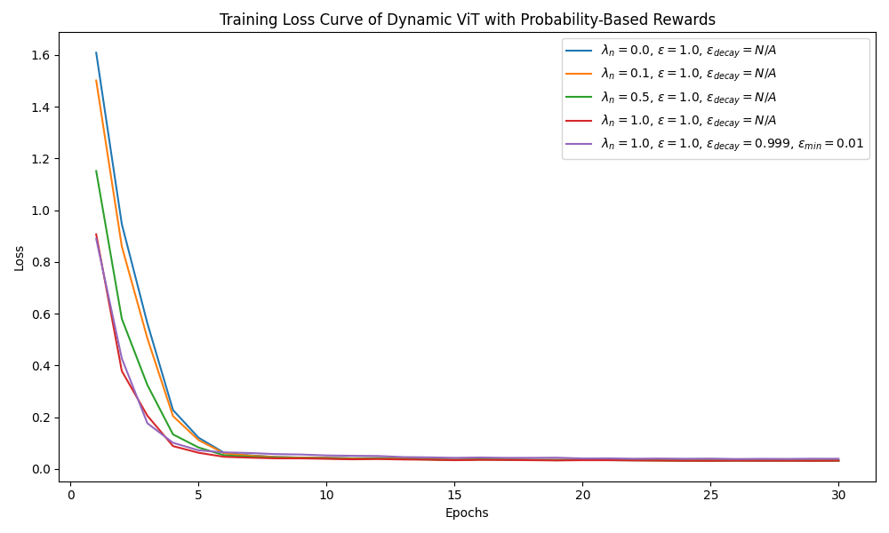
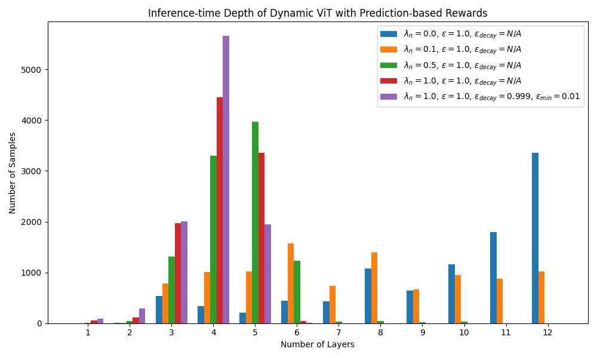
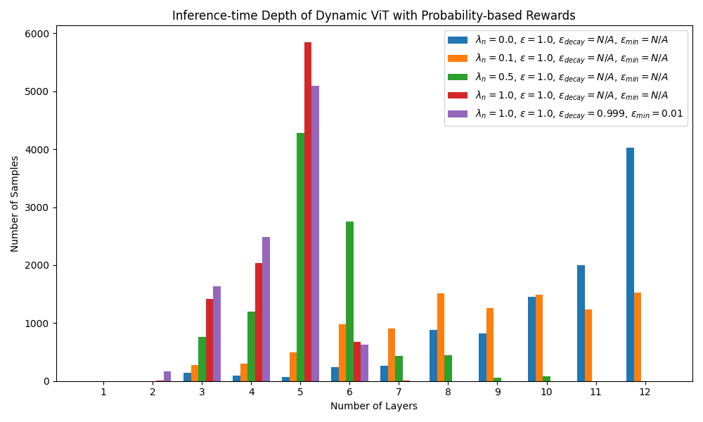

# DynamicTransformer: Contextual Bandit for Adaptive Depth

## Introduction

DynamicTransformer is a research project exploring the use of **Contextual Bandits** to implement **Adaptive Depth** in Vision Transformers (ViT). By employing an adapter network, the model dynamically decides the optimal number of transformer layers to execute for each input, aiming to balance computational efficiency with classification accuracy.

## Table of Contents

- [Project Overview](#project-overview)
- [Project Structure](#project-structure)
- [Tech Stack](#tech-stack)
- [Application Info](#application-info)
- [Getting Started](#getting-started)
- [Project Files](#project-files)
- [Results](#results)

## Project Overview

Standard Vision Transformers use a fixed number of layers for all inputs. However, some images are easier to classify than others. This project introduces a `DynamicViT` architecture that:

1.  Uses a standard ViT as a backbone (`SimpleViT`).
2.  Integrates an `Adapter` network that treats the depth selection as a Contextual Bandit problem.
3.  Optimizes the adapter to select the minimum necessary depth while maintaining high accuracy.

## Project Structure

```text
DynamicTransformer/
├── configs/            # Model and training configurations (YAML)
├── model/              # Core model architectures
│   ├── adapter/        # Contextual Bandit adapter components
│   └── vit/            # Vision Transformer backbone components
├── results/            # Training curves and performance visualizations
├── scripts/            # Training and inference entry points
├── utils/              # Data loading and miscellaneous helpers
├── requirements.txt    # Python dependencies
└── environment.yml     # Conda environment definition
```

## Tech Stack

- **Language:** Python 3.14+
- **Deep Learning Framework:** PyTorch 2.10.0
- **Computer Vision:** Torchvision
- **Optimization:** HuggingFace Transformers
- **Data Processing:** NumPy, Pillow
- **Visualization:** Matplotlib
- **Configuration:** PyYAML

## Application Info

The project currently supports two main model variants:

- **SimpleViT:** A standard Vision Transformer implementation used as a baseline and backbone.
- **DynamicViT:** A ViT enhanced with an adapter that predicts the optimal exit point (depth) based on input features.

The models are trained and evaluated on the **MNIST** dataset.

## Getting Started

### Installation

1.  Clone the repository.
2.  Install dependencies using Conda:
    ```bash
    conda env create -f environment.yml
    conda activate dynamic-transformer
    ```
    Or using pip:
    ```bash
    conda create -n dynamic-transformer python=3.14
    conda activate dynamic-transformer
    pip install -r requirements.txt
    ```

### Training

To train the baseline SimpleViT:

```bash
python scripts/train.py --model simplevit --model-config configs/simplevit_model.yml --train-config configs/simplevit_train.yml
```

To train the DynamicViT with Contextual Bandit:

```bash
python scripts/train.py --model dynamicvit --model-config configs/dynamicvit_model.yml --train-config configs/dynamicvit_train.yml
```

### Inference

To run inference with a trained model:

```bash
python scripts/infer.py --model dynamicvit --model-config configs/dynamicvit_model.yml --train-config configs/dynamicvit_train.yml --ckpt-path checkpoints/dynamicvit/final_model.pt
```

## Project Files

### `scripts/`

- **`train.py`**: Main entry point for training models. Supports both `simplevit` and `dynamicvit`.
- **`infer.py`**: Evaluation script for testing trained models on the validation set.

### `model/`

- **`dynamic_vit.py`**: Implements the `DynamicViT` wrapper, managing the interaction between the ViT backbone and the adapter.
- **`simple_vit.py`**: Implements the standard `SimpleViT` classifier.
- **`adapter/`**: Contains the adapter architecture, including a CNN encoder to extract features from the input image to make depth decisions.
- **`vit/`**: Contains the modular implementation of the Vision Transformer, including patch embeddings, attention layers, and the classifier head.

### `configs/`

- Contains YAML files defining model hyperparameters (layer counts, embedding dims) and training settings (learning rate, batch size, loss coefficients).

### `results/`

- Stores generated plots and logs from training runs.

### `utils/`

- **`dataset.py`**: Handles MNIST data downloading and preparation using `DataLoader`.
- **`misc.py`**: Helper functions for configuration loading and environment setup.

## Results

The project evaluates the effectiveness of the adaptive depth mechanism through various metrics.

### Accuracy Baseline

The baseline accuracy of the SimpleViT model on MNIST:


### Training Dynamics

The following curves show the training progress of the DynamicViT model using different reward mechanisms:

**Loss Curves:**
| Prediction Rewards | Probability Rewards |
|:---:|:---:|
|  |  |

**Depth vs. Rewards:**
| Depth Prediction Rewards | Depth Probability Rewards |
|:---:|:---:|
|  |  |
